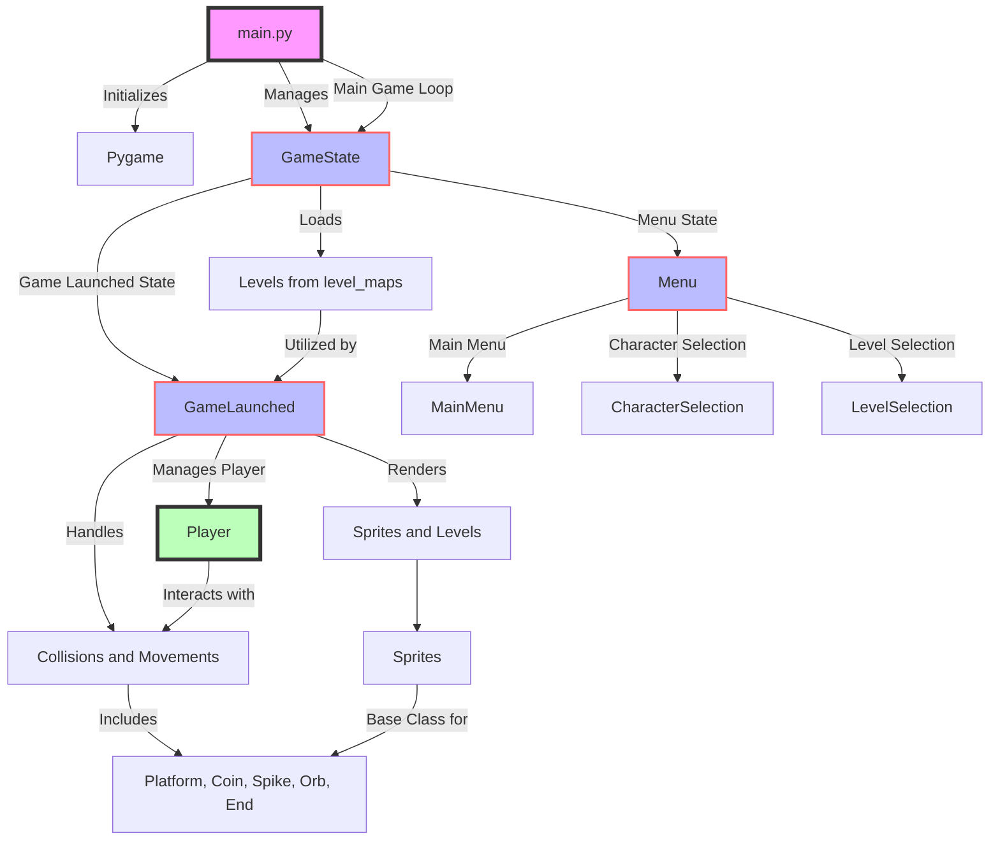

# Geometry-PyDash

Reproduction of the famous game geometry dash in python using pygame library.

## Table of Contents

1. [Introduction](#introduction)
2. [Installation](#installation)
3. [File Structure](#file-structure)
4. [Usage](#usage)
5. [Acknowledge](#acknowledge)
6. [License](#license)

## Introduction

This project is a Python implementation of the popular game Geometry Dash, using the Pygame library.

## Installation

To install and run this project, you will need Python and Pygame installed on your machine. You can install them using pip:

```bash
pip install pygame
```

Then, clone this repository and run the main.py file:

```bash
git clone https://github.com/guillaume-paris/PyDash.git
cd PyDash
python main.py
```

## File Structure

The game is structured around several directories that organize assets, levels, game states, and utilities. The core of the game is managed by a main script that initializes Pygame, handles game states, and orchestrates the main game loop.

### Diagram of the hole architecture



### Main Components
- **main.py**: The entry point of the game that initializes Pygame, creates the game window, and starts the main loop.
- **GameState**: Manages the game states, allowing transitions from the menu to the game itself and vice versa. It also controls level loading and character management.
- **Menu**: Handles the main menu, character selection, and level selection. Each menu has its own logic and is capable of communicating with GameState to modify the game's state.
- **GameLaunched**: This is the state where the game level is currently being played. It manages character movement, collisions, and rendering of sprites and levels.


### Sprites and Levels Management
- Player: Represents the player, managing movements, jumps, and collisions with obstacles.
- Sprite: A base class for sprites, used for creating entities in the game like coins, spikes, etc. These classes (e.g., Coin, Spike) inherit from Sprite and define their own behavior.
- utils/level.py: Functions for loading levels from files and initializing level elements.

### Assets
Assets are organized in the assets folder, which contains subfolders for fonts, images (including characters and menu items), and potentially sounds if added.

### Levels
Levels are stored as CSV files in the level_maps folder and are loaded by the game using the utilities provided in utils/level.py.

## Usage

When you launched the game, you will see the main menu. You can choose to play the game directly or select a level by going in the level selection menu or change character in the character selection menu.

To play the game, use the space bar to jump over obstacles. The goal is to reach the end of the level without hitting any obstacles.

If you hit an obstacle, you will lose and have to restart the level. It will increase the number of attempts.

If you reach the end of the level, you will win and can choose to play the next level.

## Acknowledge

This project was inspired by the game Geometry Dash, developed by Robert Topala and published by RobTop Games.
And most importantly, a lot of code have been inspired/copied from the following git repository: https://github.com/y330/Pydash.
I'm very grateful for the work done by the author of this repository.
The difference between his version and mine is the main menu and most of the architecture of the code.
In this project, my main goal was to understand the code and to make it more readable and maintainable.

I also have been using chatGPT for generate this documentation for example and help sometimes to understand bugs in the code and how inheritance works in python.

## License

This project is licensed under the MIT License. See the LICENSE file for details.